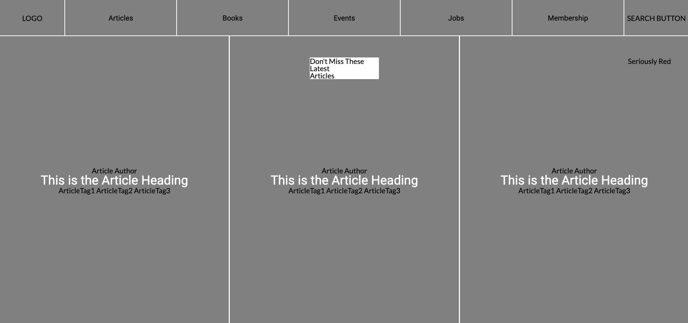

# Heatmap-of-smashing-magazine
This project is a heatmap for the Smashing Magazine. The aim of this project is to learn Design and UX.

## Project learning objectives

- Align all elements with float OR flex AND your own Grid as described in previous lesson .
- Use article tag for all articles listed on the page.

## Built With

- HTML5 and CSS3,
- Flexbox
- Grid

## Live Demo

[Live Demo Link](https://trodrige.github.io/Heatmap-of-smashing-magazine)

## Getting Started

To get a local copy up and running follow these simple example steps.

### Prerequisites

- A web browser (Chrome, Firefox or IE)

### Install

- Download the project and then open the index.html file with your browser.

## 👤 Authors

👤 **Tigpezeghe Rodrige K.**
- Github: [@Trodrige](https://github.com/Trodrige)
- Twitter: [@TRodrige](https://twitter.com/TRodrige)
- Linkedin: [Linkedin](https://www.linkedin.com/in/tigpezeghe-rodrige-k-52472310b/)

👤 **Ivan Ulises Guzman Sanchez**

- Github: [@fivan18](https://github.com/fivan18)
- Twitter: [@fivanunam](https://twitter.com/fivanunam)
- Linkedin: [fivan](www.linkedin.com/in/fivan)

## 🤝 Contributing

Contributions, issues and feature requests are welcome!

Feel free to check the [issues page](issues/).

## Show your support

Give a ⭐️ if you like this project!

## 📝 License

This project is [MIT](lic.url) licensed.
